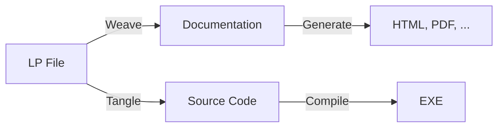
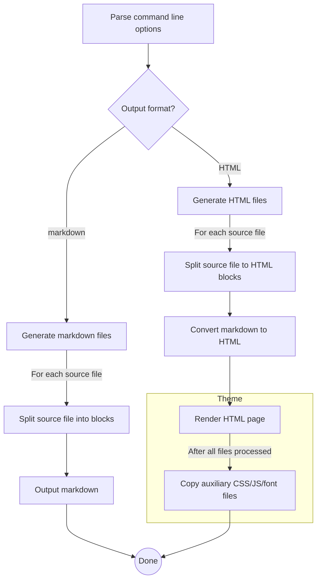

# Literate Programming and the Art of Documenting C# Code

> Let us change our traditional attitude to the construction of programs: Instead of imagining that 
> our main task is to instruct a computer what to do, let us concentrate rather on explaining to human 
> beings what we want a computer to do.
>
> _Donald Knuth, Computer Journal, 1984_

[Literate programming](https://en.wikipedia.org/wiki/Literate_programming) is a software design 
methodology proposed by [Donald Knuth](https://en.wikipedia.org/wiki/Donald_Knuth). Its guiding 
principle is that computer programs should be written like a book or an essay. Knuth argues that 
good programmers do not focus just on writing code, they also document the thought processes 
that led them to the chosen implementation; describing not only _what_ the code does, but _why_. 
This helps other programmers understand the code better, but also the author will find it easier 
to revise the code later on.

Back in the 80s when Knuth first introduced his idea, he wrote a set of tools to manage code
and documentation together. These tools take a file containing text and code interleaved and 
produce the source code to be compiled, as well as the "documentation source" that can be converted 
to a readable format. They are basically preprocessors which operate on the same source file, 
extracting different parts from it. Knuth called this source language `WEB`, hence the tools 
were called _Weave_ and _Tangle_. Weave produces the documentation in 
[_TeX_](https://en.wikipedia.org/wiki/TeX) format and Tangle produces compilable code. The 
concept is depicted in the picture below.

A more common way to combine code and documentation is to write the documentation inside comments and 
extract it using a post-processor, leaving the compilation process unchanged. For example, Haskell, 
Python, and Lisp have literate programming tools available that work like this. However, there hasn't 
been any notable attempts to make literate programming possible in .NET. One of the reasons why literate 
programming is unfamiliar to most programmers is because the tooling has not been available for 
the mainstream development platforms.

Another reason for literate programming's lack of popularity is that it requires the programmer
to be proficient in two traits instead of just one. Writing fluent prose can be as hard as writing 
good code - and equally time consuming as well. Nevertheless, the benefits of having both working 
software and comprehensive documentation can sometimes outweigh the costs. Especially, when writing 
software whose inner workings need to be understood by others: libraries, tutorials, example 
programs, and so on. Additional benefit is that the documentation can be produced in various 
formats: as a PDF, blog post, presentation, website, or even as a complete book. In fact, 
there are quite popular recently published books that have been written as literate programs, for 
example the [Physically Based Rendering](http://www.pbrt.org/) book.

In .NET languages the standard way of documenting code is to write XML comments. API documentation
generated from XML comments serves as a reference manual that can be used to quickly find what a 
specific class or method does. When done properly, it can be a satisfactory way of describing the 
correct use of an API. However, writing XML comments is a tedious task, and requires a 
lot of discipline. XML comments tend to be verbose and repetitive which means that the produced 
documentation is dense and boring to read. In many cases, reading the code is faster than browsing 
through the documentation. There is little additional information in the XML comments, usually.

## `csweave` - Literate Programming Tool for C#

To make literate programming possible also in C#, I wrote a tool called `csweave`. The 
documentation you are reading right now is generated from its source code. `csweave` 
uses a hybrid approach to unite code and documentation. You can either embed your 
documentation inside comment blocks in C# code, or you can start with separate text files 
and include sections of code in them by wrapping the code inside
[regions](https://docs.microsoft.com/en-us/dotnet/csharp/language-reference/preprocessor-directives/preprocessor-region). 
In either case the documentation is written in [markdown language](https://en.wikipedia.org/wiki/markdown), 
which allows you to structure and format your text.

Since we are piggybacking on the existing language constructs (comments and regions),
the compilation process is not altered. So, the tangling part of literate programming
is covered by the existing compilers. The weaving part is taken care by `csweave`, which 
processes the source and markup files and produced the documentation from them. It
can create either plain markup files, which can be then further processed with markdown
converters such as [Pandoc](https://pandoc.org/), or alternatively it can build a 
feature-rich web site with dozens of configurable options.

### Documentation in Comments

If you prefer incorporating documentation into code, you can write it inside comments.
You don't need to use special syntax to annotate the documentation. Multi-line comment blocks 
surrounded with `/*` and `*/` will be extracted and included in the output. Single line comments 
starting with `//`, as well as XML comments, are treated as code by `csweave`. 

Literate comments can appear anywhere in your code. The goal is to write your code in small
pieces as you are describing what it does (and _why_) in the comments. This way the generated 
documentation becomes more readable and easy to follow.

### Inserting Code Regions in Markdown

If you don't want to clutter your code with a lot of comments, the other option is to write
your prose in separate markdown files. When you want to include a piece of code in your text,
you can use a _macro_. This feature was already present in Knuth's original LP tools. A macro
is a piece of code that is wrapped inside the `region` directive. Regions have names, which
identify the block of code they contain. When you want to include that block of code into your 
markdown file, you just write the region's name inside double angle brackets. That triggers
the macro expansion. A macro call must be the only thing on a line - otherwise it is not 
recognized. For example, adding macro call `<<Main Error Handler>>` expands to the following 
code from [Program.cs](src/Program.html):

<<Main Error Handler>>

Note that if you hace defined comment blocks inside the region those will be expanded also.
Since we use the names of the regions as macro identifiers, the names must be unique. Otherwise 
`csweave` complains that you have defined ambiguous macros.

## The Controversy about _Real_ Literate Programming

Reading the Wikipedia page about literate programming one gets an impression that most of
the literate programming tools are doing it wrong. Knuth's goal with literate programming was 
not just to provide documentation, but introduce a completely new programming paradigm, in 
which the structure of programs would be more free-form than in "traditional" languages. The 
use of macros to write programs in piecewise manner and tangling them together was an 
essential part of his proposition.

If you look at literate programming as a better way to organize big software projects as Knuth
suggests, the benefits are questionable. In fact, the whole justification of the method is 
somewhat obsolete. Compilers nowadays do not impose strict rules about the order of definitions. 
When they do, it is because the language designer has intentionally introduced modular constructs 
such as interfaces, classes, and namespaces which help us organize our code into logical units
that contain related functionality. Organizing your documentation in an order that makes sense 
to a reader is a good idea, but structuring your program accordingly does not necessarily make 
finding your way in it any easier. 

This does not mean that the idea of literate programming is without merit, though, quite the
opposite. Documentation is largely overlooked nowadays and having a good quality documentation
is seen as a secondary goal at best. Writing documentation and code together forces you to think 
about what you are trying to accomplish, and provides a different point of view to the problem 
you are solving. You have to be able to verbally describe how your code works. If that seems like 
a hard task, it is a clear sign that your code needs improvement.

By calling `csweave` a literate programming tool instead of a "documentation generation tool" 
as the Wikipedia article suggests, we are taking a standpoint that literate programming has 
evolved from its origins, and practicing it with modern programming languages requires 
abandoning some of its premises. Being a purist hardly helps getting more people to use
literate programming. Its adoption is pretty marginal as it is.

## The Structure of the Program

We will go through the whole implementation of `csweave`, using it as an example on how to 
write programs in literate style. In the end we have covered all the features and options
available in the program. Not just how they work, but also how they are implemented.

The high-level flow chart of the program is shown below. You can click a box in the diagram
to jump to the documentation of the corresponding module. Alternatively, you can jump to a page
by clicking a section in the table of contents. You can also move to the next and previous page 
using the navigation buttons on the top and the bottom.

