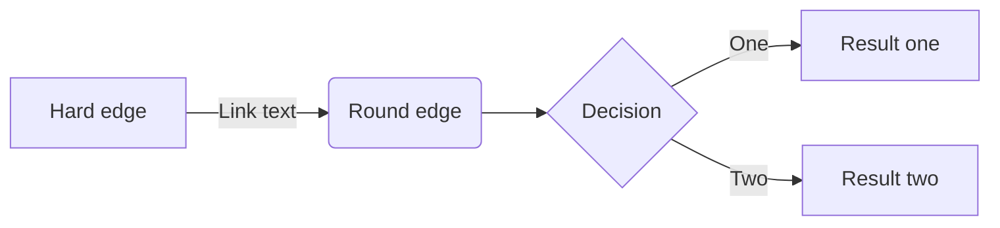

# Tips & Tricks

There are some additional features and tools you can put to use, to make the 
literate programming experience even better. Let's look at few of them.

## Including Formulas

`csweave` uses the [Markdig](https://github.com/lunet-io/markdig) parser to 
generate HTML from markdown. Markdig supports mathematical formulas inside 
the markdown. Formulas are rendered by the [MathJax](https://www.mathjax.org/) 
Javascript library. The library is loaded only if the `UseMath` property is
specified in the [front matter](FrontMatter.html).

To include formulas in your comments write them in the 
[_TeX_](https://en.wikipedia.org/wiki/TeX) format. For example, the quadratic
equation is defined like this:

`$x = { -b \pm \sqrt{b^2 - 4ac} \over 2a }$` 
 
and rendered like this: 

$x = { -b \pm \sqrt{b^2 - 4ac} \over 2a }$.

MathJax library is loaded from a _CDN_ (Content Delivery Network) and not 
included in the auxiliary files coming with the theme. The reason for this is 
the big size of the library, and the fact that it is not always needed. Enabling 
the feature will increase page loading times, but the penalty is not that big. 
When mathematics support is required, this feature is invaluable.

## Including Diagrams

Another feature that makes your documentation more lively and readable is the
support for diagrams. Obviously you can include PNG/GIF/JPG images in your 
markdown using the `!` syntax. This is a standard markdown feature which works
as expected. 

However, if you just want to present diagrams that illustrate the program logic, 
drawing those as images can be quite laborious. You need to pick up a paint or 
drawing program, export the pictures to files and include the files in your 
project. Maintaining the pictures also quickly becomes a chore.

For this purpose, it is easier to define your diagram directly inside the 
markdown and let the [mermaid](http://knsv.github.io/mermaid/) library generate
the images. Mermaid support flowcharts, sequence diagrams, and Gant diagrams. 
On of these usually fills the need when a clarifying picture is called for.
 
 Below is an example diagram that is generated from the following definition:
 ```
    ```mermaid
    graph LR
        A[Hard edge] -->|Link text| B(Round edge)
        B --> C{Decision}
        C -->|One| D[Result one]
        C -->|Two| E[Result two] 
    ```
```


Diagram support is not enabled by default. To enable it, set the `UseDiagrams`
property to `true` in the [front matter](FrontMatter.html). You can also change
the visual appearance of the diagrams with the `DiagramStyle` property.

## Editing Markdown in Visual Studio

Literate programming using Visual Studio can be made more pleasant by installing 
couple of extensions. [Visual Studio Marketplace](https://marketplace.visualstudio.com/) 
offers multiple choices if you are looking for an extension that provides syntax 
highlighting and support for markdown files. I am using 
[Markdown Editor](https://github.com/madskristensen/MarkdownEditor) for this 
purpose. 

There is far more scarce supply of extensions that help editing markdown inside 
C# comments, though. The only option I have found is 
[MarkdownComments](https://marketplace.visualstudio.com/items?itemName=JulienDuminil.MarkdownComments)
by Julien Duminil. It has a few very handy features, such as showing headings 
in bigger font and previewing the pictures. However, it has a couple of issues 
which cause the latest version not working correctly with C# files (only 
with C++). I have submitted a pull request to fix those issues, but it has not 
yet been merged to the master branch.

If you feel experimental and want to try it out, I suggest taking my branch
from [GitHub](https://github.com/johtela/MarkdownComments) and building the
extension yourself. Installing it is just a matter of double-clicking the
produced installer. You can uninstall it easily from Visual Studio, if you
don't like it.

The last extension I would recommend is the 
[Visual Studio Spell Checker](https://github.com/EWSoftware/VSSpellChecker).
Spell checking is of course completely optional, and the value of correct 
spelling is subjective. Nevertheless, I find it very helpful when writing
documentation that somebody or something is checking what I type. When
writing code the compiler is doing that job. With documentation there is
nothing helping you by default. That is why I think a spell checker is a
precious tool - also within Visual Studio.

## Running `csweave` inside the Build

Since `csweave` is a command line tool, it can be integrated to the build 
process with little effort. You can add it as the post-build step in 
Visual Studio solution, or incorporate it in your continuous integration 
scripts. However you are doing it, just bear in mind that `csweave` will 
actually compile the project. So, if your code base is big, the tool will 
take some time. Therefore, I don't recommend running it automatically within
every build. Better launch it separately when you want to review your 
documentation.

Also, I don't suggest that the errors coming from the tool should be used
as the cause of failing a build. As mentioned in the documentation of the 
[MSBuildHelpers](src/MSBuildHelpers.html) class, there are cases when 
Roslyn reports errors, even though the project compiles correctly in 
Visual Studio.

If you don't want to see the compilation errors at all, or if they hinder
your build process, you can get rid of them by redirecting STDERR to null. 
In command prompt, it is done like this:
```
csweave <options> 2> nul
```
In PowerShell the same thing is quite a bit more complicated. It is not enough 
to suppress the error messages, you also need to make sure that PowerShell
does not terminate `csweave` immediately when it outputs to STDERR. So, we
need to temporarily set `$ErrorActionPreference` variable to ignore the errors.
```
& {
    $ErrorActionPreference = "SilentlyContinue"
    & csweave <options>
}
```
`csweave` will indicate with its return code if it succeeded or not. To check
if the document generation worked in PowerShell, you should inspect the 
`$LASTEXITCODE` variable.
```
if ($LASTEXITCODE -eq 0)
{
    # Document generation succeeded.
}
```